# clouds-dz03
Безопасность в облачных провайдерах


«Безопасность в облачных провайдерах»  

Используя конфигурации, выполненные в рамках предыдущих домашних заданий, нужно добавить возможность шифрования бакета.

---
## Yandex Cloud   

1. С помощью ключа в KMS необходимо зашифровать содержимое бакета:

 - создать ключ в KMS;

[Ключь КМС](kms.tf)

Ключ задан, все данные пересозданы заново, так как они подписываются на первом этапе.

 - с помощью ключа зашифровать содержимое бакета, созданного ранее.

 при создании нового бакета, после смены имени  выполняю траблшутинг теерраформ state+

 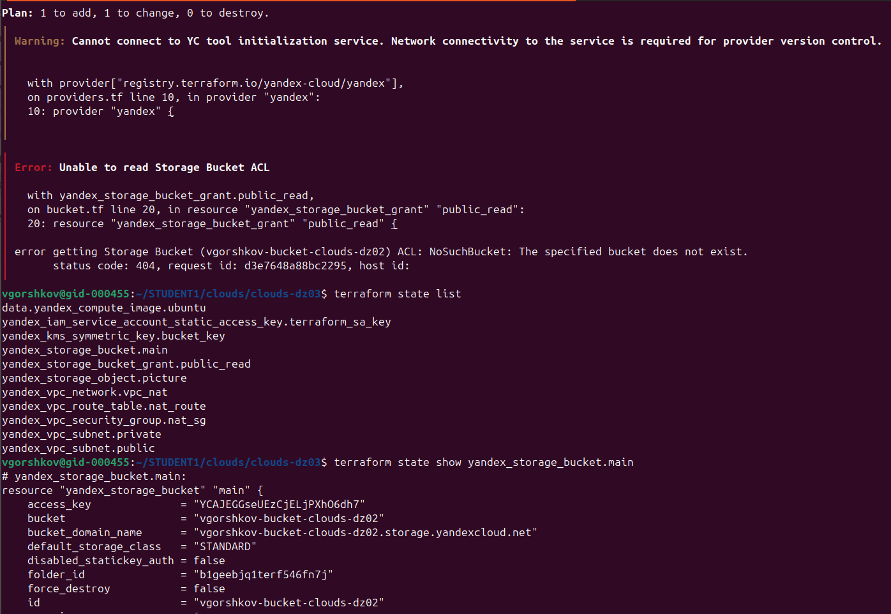
 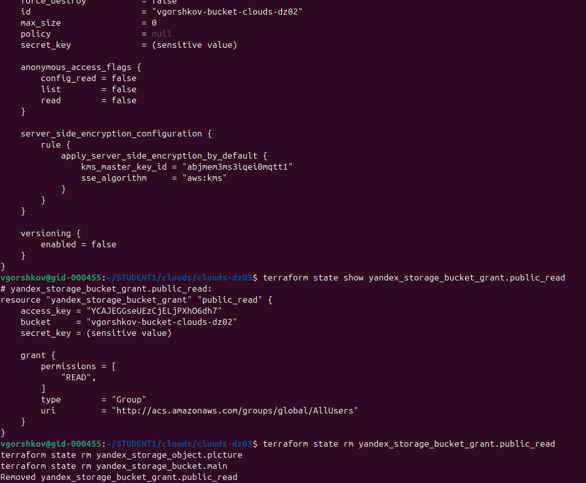
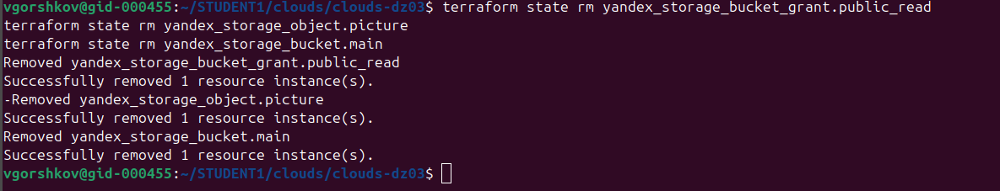

Применим новую конфигурацию.
```
vgorshkov@gid-000455:~/STUDENT1/clouds/clouds-dz03$ terraform apply --auto-approve
data.yandex_compute_image.ubuntu: Reading...
yandex_kms_symmetric_key.bucket_key: Refreshing state... [id=abjmem3ms3iqei0mqtt1]
yandex_vpc_network.vpc_nat: Refreshing state... [id=enpg8ai739jnohrjuc67]
yandex_iam_service_account_static_access_key.terraform_sa_key: Refreshing state... [id=ajeknfir21jbl8u1j9ks]
data.yandex_compute_image.ubuntu: Read complete after 0s [id=fd8jcu0hns086qm7ldj7]
yandex_vpc_subnet.public: Refreshing state... [id=e2lfb26magl5rs1h5inq]
yandex_vpc_route_table.nat_route: Refreshing state... [id=enp1i257817rbvmtb9d5]
yandex_vpc_security_group.nat_sg: Refreshing state... [id=enp12dlk043tp0jqv47b]
yandex_vpc_subnet.private: Refreshing state... [id=e2l0st2qj5qaaki7c921]

Terraform used the selected providers to generate the following execution plan. Resource actions are indicated with the following symbols:
  + create
  ~ update in-place

Terraform will perform the following actions:

  # yandex_kms_symmetric_key.bucket_key will be updated in-place
  ~ resource "yandex_kms_symmetric_key" "bucket_key" {
      ~ created_at          = "2026-07-12T18:00:32Z" -> (known after apply)
        id                  = "abjmem3ms3iqei0mqtt1"
      + labels              = (known after apply)
        name                = "storage-kms-key"
      ~ rotated_at          = "1970-01-01T00:00:00Z" -> (known after apply)
      ~ rotation_period     = "8760h" -> "2160h"
        # (6 unchanged attributes hidden)
    }

  # yandex_storage_bucket.main will be created
  + resource "yandex_storage_bucket" "main" {
      + access_key            = "YCAJEGGseUEzCjELjPXhO6dh7"
      + acl                   = (known after apply)
      + bucket                = "vgorshkov-bucket-clouds-dz03"
      + bucket_domain_name    = (known after apply)
      + default_storage_class = (known after apply)
      + folder_id             = (known after apply)
      + force_destroy         = false
      + id                    = (known after apply)
      + policy                = (known after apply)
      + secret_key            = (sensitive value)
      + website_domain        = (known after apply)
      + website_endpoint      = (known after apply)

      + anonymous_access_flags (known after apply)

      + grant (known after apply)

      + server_side_encryption_configuration {
          + rule {
              + apply_server_side_encryption_by_default {
                  + kms_master_key_id = "abjmem3ms3iqei0mqtt1"
                  + sse_algorithm     = "aws:kms"
                }
            }
        }

      + versioning (known after apply)
    }

  # yandex_storage_bucket_grant.public_read will be created
  + resource "yandex_storage_bucket_grant" "public_read" {
      + access_key = "YCAJEGGseUEzCjELjPXhO6dh7"
      + bucket     = "vgorshkov-bucket-clouds-dz03"
      + secret_key = (sensitive value)

      + grant {
          + permissions = [
              + "READ",
            ]
          + type        = "Group"
          + uri         = "http://acs.amazonaws.com/groups/global/AllUsers"
        }
    }

  # yandex_storage_object.picture will be created
  + resource "yandex_storage_object" "picture" {
      + access_key   = "YCAJEGGseUEzCjELjPXhO6dh7"
      + acl          = "private"
      + bucket       = "vgorshkov-bucket-clouds-dz03"
      + content_type = "image/jpeg"
      + id           = (known after apply)
      + key          = "Victor_E_Gorshkov.jpg"
      + secret_key   = (sensitive value)
      + source       = "./Victor_E_Gorshkov.jpg"
    }

Plan: 3 to add, 1 to change, 0 to destroy.
yandex_kms_symmetric_key.bucket_key: Modifying... [id=abjmem3ms3iqei0mqtt1]
yandex_kms_symmetric_key.bucket_key: Still modifying... [id=abjmem3ms3iqei0mqtt1, 00m10s elapsed]
yandex_kms_symmetric_key.bucket_key: Still modifying... [id=abjmem3ms3iqei0mqtt1, 00m20s elapsed]
yandex_kms_symmetric_key.bucket_key: Still modifying... [id=abjmem3ms3iqei0mqtt1, 00m30s elapsed]
yandex_kms_symmetric_key.bucket_key: Still modifying... [id=abjmem3ms3iqei0mqtt1, 00m40s elapsed]
yandex_kms_symmetric_key.bucket_key: Modifications complete after 41s [id=abjmem3ms3iqei0mqtt1]
yandex_storage_bucket.main: Creating...
yandex_storage_bucket.main: Creation complete after 4s [id=vgorshkov-bucket-clouds-dz03]
yandex_storage_bucket_grant.public_read: Creating...
yandex_storage_bucket_grant.public_read: Creation complete after 2s
yandex_storage_object.picture: Creating...
yandex_storage_object.picture: Creation complete after 1s [id=Victor_E_Gorshkov.jpg]
╷
│ Warning: Cannot connect to YC tool initialization service. Network connectivity to the service is required for provider version control.
│ 
│ 
│   with provider["registry.terraform.io/yandex-cloud/yandex"],
│   on providers.tf line 10, in provider "yandex":
│   10: provider "yandex" {
│ 
│ (and one more similar warning elsewhere)
╵

Apply complete! Resources: 3 added, 1 changed, 0 destroyed.
vgorshkov@gid-000455:~/STUDENT1/clouds/clouds-dz03$ 
```

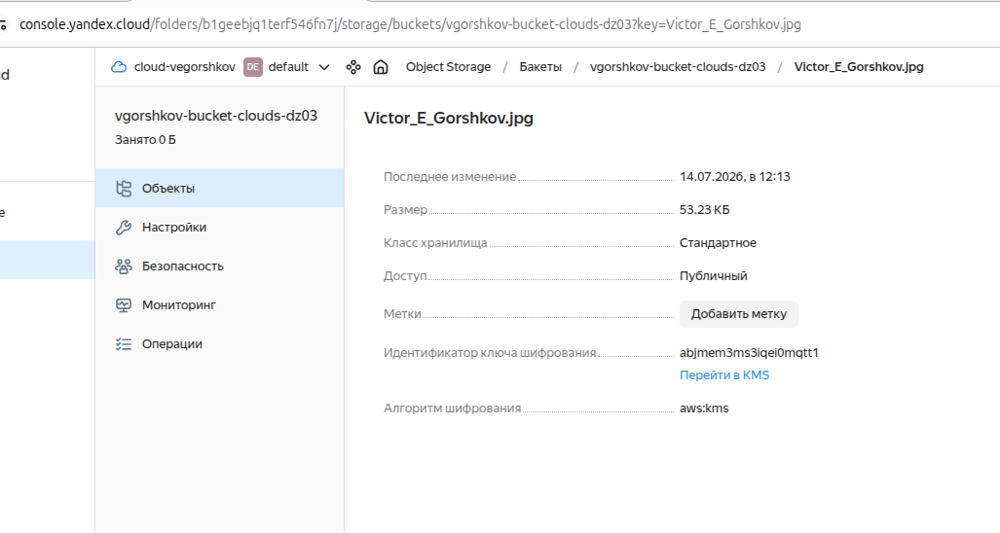

При получении ссылки получаем XML, добавим блок прав для вышестоящего бакета, хотя через консоль права отображаются норм READ  для всех пользователей. И на самой картинке норм. 
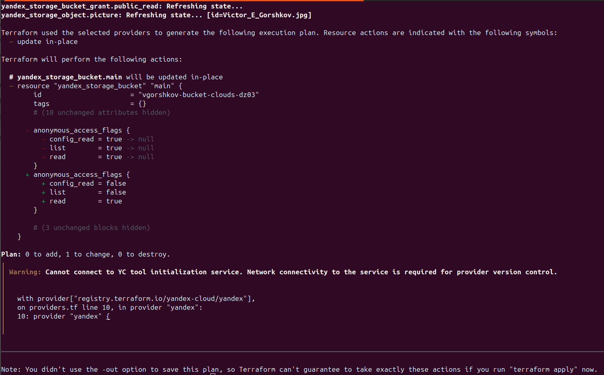

Выяснил: ...уточнение:
Yandex Support ответили:
```
Проверили бакет и вижу, что в нем включено шифрование. Из-за этого возникает ошибка с доступом, так как у публичного пользователя нет доступа к ключу.
```

Задание №2

(Выполняется не в Terraform)* Создать статический сайт в Object Storage c собственным публичным адресом и сделать доступным по HTTPS:
создать сертификат;
создать статическую страницу в Object Storage и применить сертификат HTTPS;
в качестве результата предоставить скриншот на страницу с сертификатом в заголовке (замочек).


Решение:
Переходим в yandex.console  Object Storage

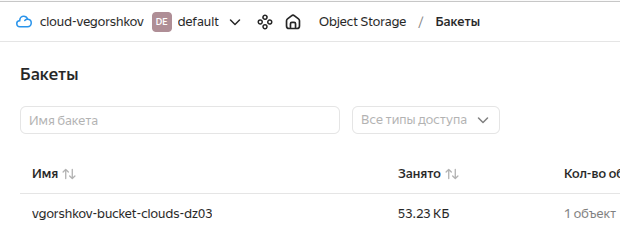

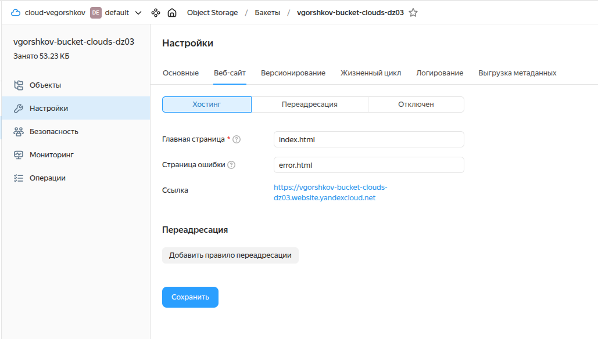

Создаем index.html  и error.html загружаем их в наш бакет
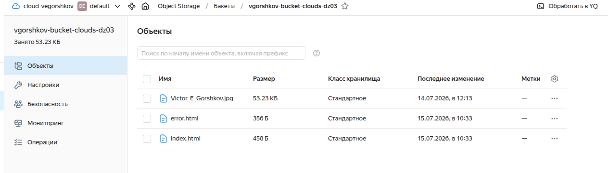 

Идентификатор шифрования так же присутствует
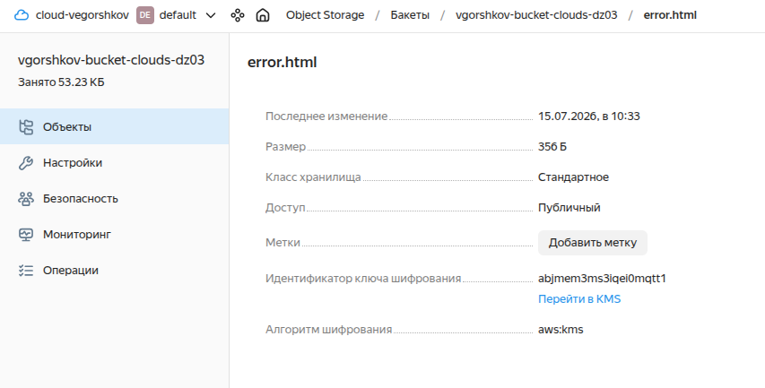

Разрешим доступ при помощи KMS

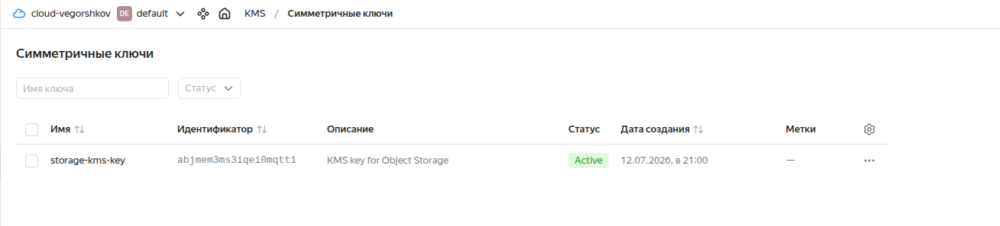

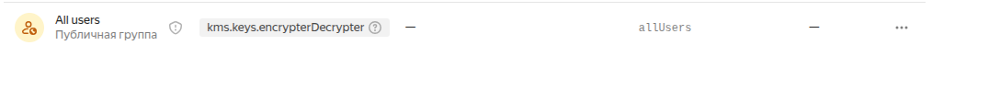

Видим что ошибка access denied уже изчезла
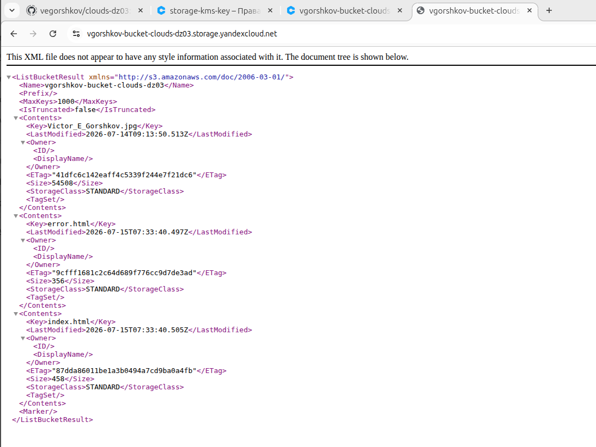

и мы видим список файлы содержимое бакета :-)

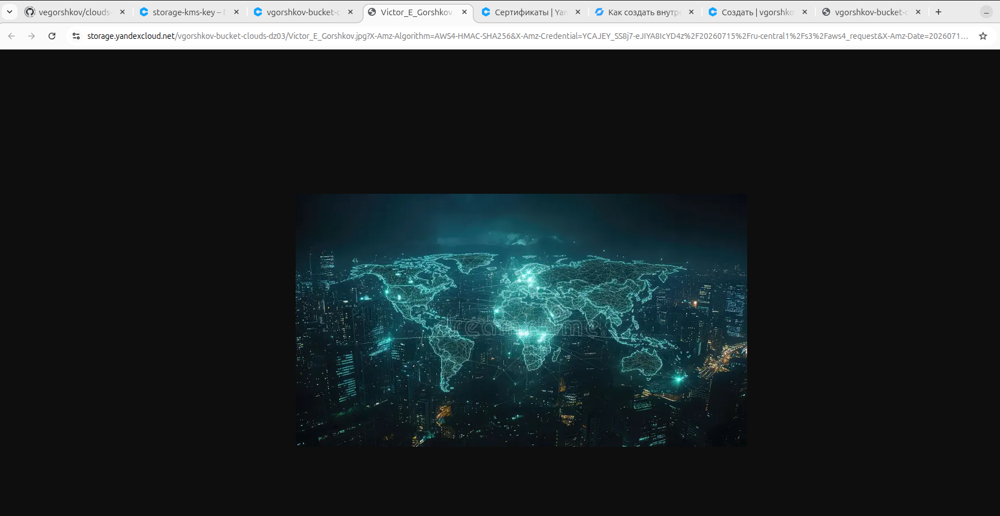

Добавим KMS роль Viewer

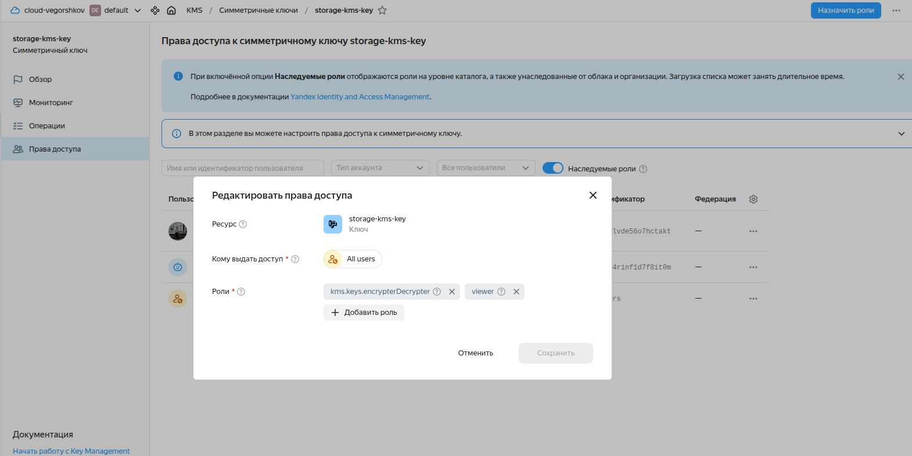

Теперь видим, что наш сайт открывается и подписан сертификатом :-)
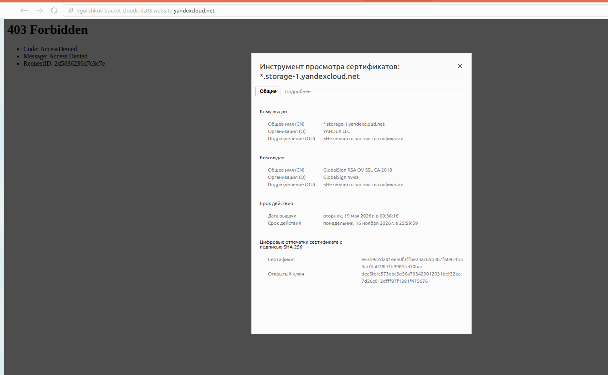

Но пока 403...

Ура, манипуляция с правами и работает.

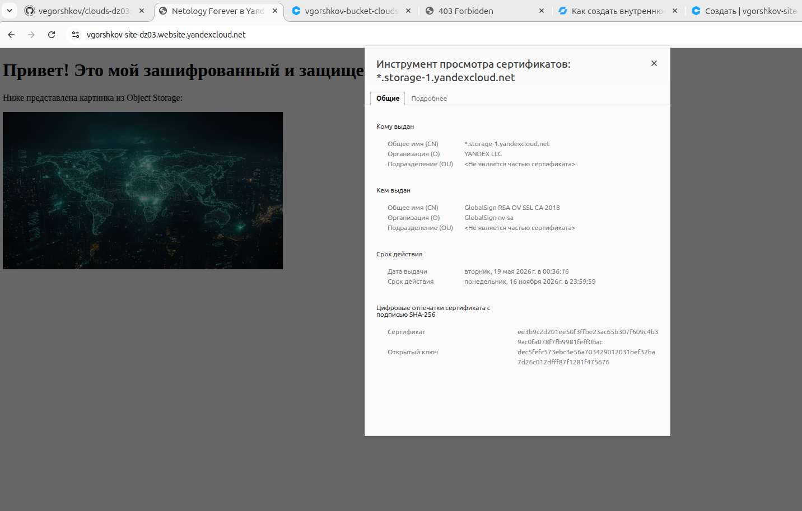


Спасибо!
